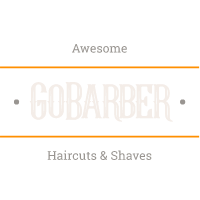

<div align="center" style="margin-bottom: 20px;">

</div>

<div align="center" style="margin: 20px;">

[](https://github.com/ianmateusES/gobarber-typescript/LICENSE.md)


<p align="center" >
  <a href="#fire-prévia-da-aplicação"> :fire: Prévia da Aplicação</a> |
  <a href="#rocket-tecnologias-usadas"> :rocket: Tecnologias Usadas</a> |
  <a href="#thinking-como-contribuir"> :thinking: Como Contribuir?</a> |
  <a href="#zap-executando-o-projeto"> :zap: Executando o Projeto </a> 
</p>

</div>

## :barber: O projeto

Aplicação para agendar e gerenciar serviços de barbeiros, onde prestadores de serviços podem se cadastrar,
e usuários poderão marcar agendamentos com estes provedores.

## :fire: Prévia da Aplicação

<div align="center"> 

</div>

### :rocket: Tecnologias Usadas

O projeto foi feito com as seguintes tecnologias:

- [NodeJS](https://nodejs.org/en/)
- [ReactJS](https://pt-br.reactjs.org/)
- [React Native](https://reactnative.dev/)
- [ExpressJS](https://expressjs.com/pt-br/)
- [JWT](https://jwt.io/)
- [Yup](https://github.com/jquense/yup)
- [Styled-Components](https://styled-components.com/)

{...}

## :thinking: Como Contribuir?
**Faça um fork deste repositório**

```bash
# Clone o seu fork
$ git clone url-do-seu-fork && cd gobarber-typescript

# Crie uma branch com sua feature ou correção de bugs
$ git checkout -b minha-branch

# Faça o commit das suas alterações
$ git commit -m 'feat/bug/fix: minhas alterações'

# Faça o push para a sua branch
$ git push origin minha-branch
```

Depois que o merge da sua pull request for feito, você pode deletar a sua branch.

## :zap: Executando o Projeto
#### Clonando o projeto
```sh
$ git clone https://github.com/ianmateusES/gobarber-typescript.git
$ cd gobarber-typescript
```
#### Iniciando a API
```sh
$ cd backend

# Criando a imagem Docker do banco de dados.
# Basta ter o Docker instalado em sua máquina.
$ docker-compose up -d # Iniciará em background

# Rodando as migrations para o banco de dados e iniciando o projeto
$ yarn && yarn typeorm migration:run && yarn dev:server
```

#### Iniciando o Frontend
```sh
$ cd web
$ yarn && yarn start
```
#### Iniciando o Mobile(Android)
```sh
$ cd mobile
$ yarn && yarn android && yarn start
```

### :memo: Licença

Este projeto é desenvolvido sob a licença MIT. Veja o arquivo [LICENSE](LICENSE.md) para saber mais detalhes.

<p align="center" style="margin-top: 20px; border-top: 1px solid #eee; padding-top: 20px;">Feito com ❤ by <strong> Ian Mateus</strong> </p>
